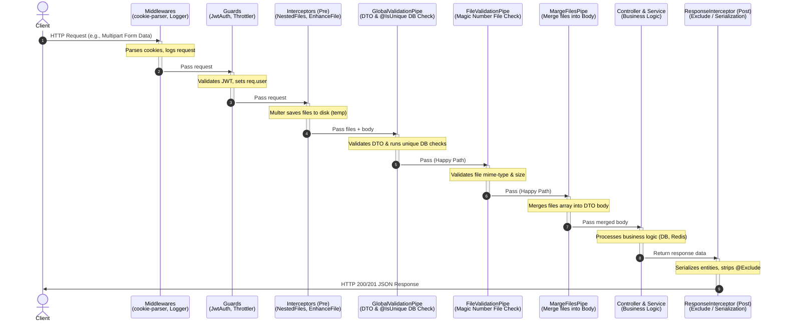
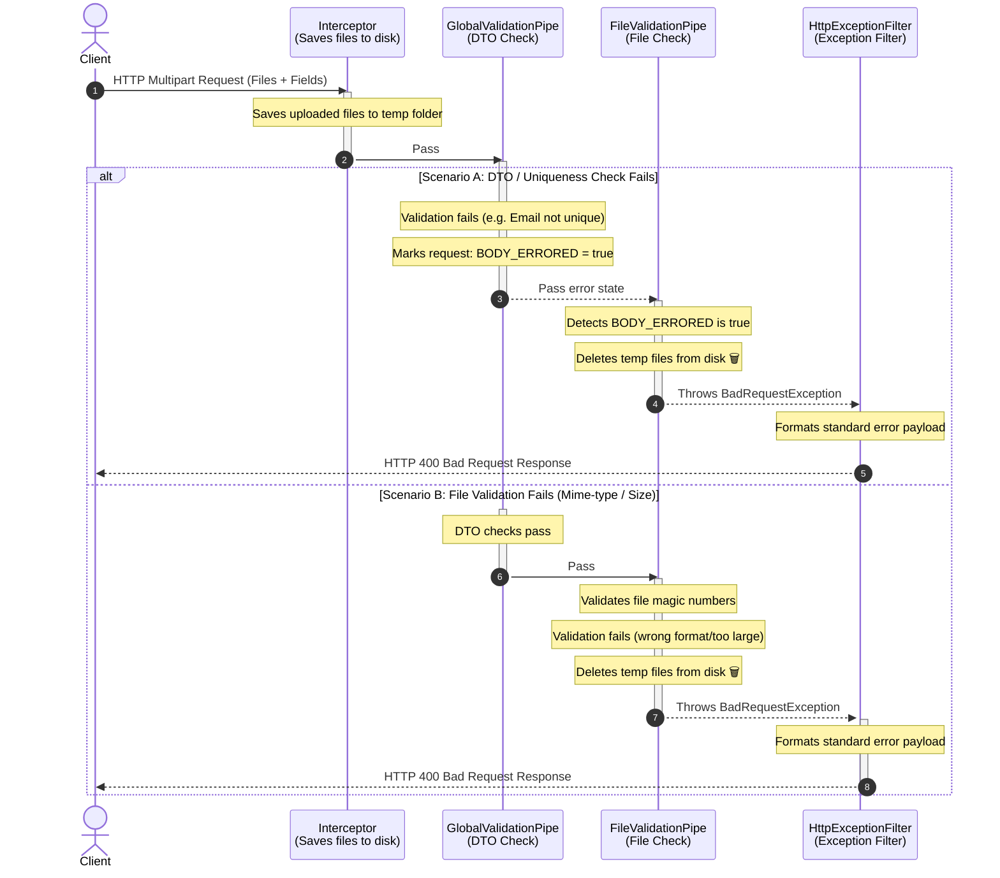

# Nest-0: The Ultimate Architectural Reference Manual

This repository serves as an exhaustive reference implementation for complex NestJS patterns, focusing on **Atomic Request Processing**, **Advanced File Handling**, and **Production-Grade Auth Token Rotation** with distributed locking and Pub/Sub mechanism.

---

## 1. Development & Setup

1. **Install**: `npm install`
2. **Environment**: Create `.env` with the following variables:
   ```env
   APP_PORT=4400
   APP_PREFIX=api
   APP_URL=http://localhost:${APP_PORT}/${APP_PREFIX}

   DB_NAME=nest-0
   DB_USER=postgres
   DB_PASSWORD=6666
   DB_PORT=5432
   DB_HOST=localhost
   DB_URL=postgresql://${DB_USER}:${DB_PASSWORD}@${DB_HOST}:${DB_PORT}/${DB_NAME}?schema=public

   JWT_ACCESS_SECRET=accessToken
   JWT_ACCESS_EXPIRES_IN=20s
   JWT_REFRESH_SECRET=refreshToken
   JWT_REFRESH_EXPIRES_IN=20m

   REDIS_HOST=localhost
   REDIS_PORT=6379

   PUBLIC_FOLDER=public
   PUBLIC_FOLDER_URL=http://localhost:${APP_PORT}
   ```
3. **Database**: `npx prisma db push` to synchronize the PostgreSQL schema.
4. **Run**: `npm run start:dev` for development mode with watch.
5. **Run tests**:
   * Unit tests: `npm run test`
   * E2E tests: `npm run test:e2e`
   * All tests: `npx jest`

---

## 2. Project Overview & Philosophy

Nest-0 is built on the **"Atomic" request principle (All-or-Nothing)**. In a modern web application, a single request often involves multiple side effects: uploading files to disk, checking database uniqueness, and validating complex DTOs.

In many systems, if DTO validation fails *after* a file has been uploaded, that file remains on the server as "garbage." Nest-0 solves this by synchronizing the lifecycle of Interceptors, Guards, and Pipes. If any part of the validation chain fails, the system automatically rolls back side effects (e.g., deleting temporary files) before the request ever reaches the controller.

---

## 3. Request Execution & Atomic Flow Diagrams

To handle complex operations (such as multi-part file uploads combined with database constraint validation), Nest-0 coordinates middleware, guards, interceptors, and pipes into a strict request execution pipeline.

### 3.1 Request Execution Lifecycle (Happy Path)

This diagram shows how a successful request flows through the entire Nest-0 architecture:



### 3.2 Atomic Rollback Lifecycle (Validation & Constraint Failures)

This diagram shows how the system automatically cleans up side effects (specifically temporary files uploaded to disk) if a request fails at any point in the validation chain:



---

## 4. Global Infrastructure & Bootstrapping (`src/main.ts`)

The entry point of the application sets up a robust foundation:
- **DI-Powered Validation**: `useContainer(app.select(AppModule))` connects NestJS's Dependency Injection with the `class-validator` library. This is what allows our `UniqueConstraint` to inject the `PrismaService` or `UserService`.
- **Global Sanitization**: `ResponseInterceptor` is applied globally to ensure every outgoing response is processed through our serialization layer.
- **Middleware Integration**: 
    - `cookie-parser`: Essential for reading `refreshToken` from secure, HttpOnly cookies.
    - `LoggerMiddleware`: Automatically logs the method and URL for every incoming request.
- **Dynamic Prefixing**: Uses `ConfigService` to set a global API prefix (e.g., `/api`) dynamically from environment variables.

---

## 5. Modular Architecture (The Backbone)

The application is organized into highly decoupled modules, coordinated by a central infrastructure hub.

### 5.1 `SharedModule` (Global Infrastructure Hub)
`SharedModule` is the foundation of the app. It centralizes all cross-cutting concerns:
- **`ConfigModule`**: Loaded with `.env` support and variable expansion. Available globally.
- **`ServeStaticModule`**: Asynchronously configured to serve files from the `public` directory.
- **`PrismaModule`**: Provides a singleton `PrismaService` for database operations.
- **`AuthModule`**: (Located in `shared/auth`) Handles JWT strategies, token generation, and security logic.
- **`UploadModule`**: Centralizes Multer configurations used by various interceptors.

### 5.2 `AppModule`
The root node that imports `SharedModule`, `UserModule`, and `ProductModule`. 
- **Global Providers**: It registers `HttpExceptionFilter` (as `APP_FILTER`) and `GlobalValidationPipe` (as `APP_PIPE`). This allows these components to use Dependency Injection while remaining global.
- **Middleware Application**: Implements `NestModule` to apply `LoggerMiddleware` to all routes.

---

## 6. Common Layer: Utilities, Constants & Custom Features (`src/common/`)

Shared logic, definitions, and custom decorators used across all modules.

### 6.1 Custom Decorators Deep-Dive
- **`@IsUnique(serviceMethod)`**: The core of our async validation. It marks a field for a database check.
  ```typescript
  export class SignUpDto {
    @IsUnique('isEmailUnique') // Calls UserService.isEmailUnique
    email: string;
  }
  ```
- **`@Public()`**: A metadata decorator that tells guards to skip authentication for a specific route.
  ```typescript
  @Public()
  @Get('check-status')
  async checkStatus() {
    return { status: 'OK' };
  }
  ```
- **`@User(key?)`**: Type-safe extraction of the user payload from the request.
  ```typescript
  @Get('me')
  @UseGuards(JwtAccessAuthGuard)
  async me(@User('id') userId: number) { 
    return userId; 
  }
  ```
- **`@ValidatorOptions(options)`**: Per-DTO customization for `class-validator`.
    - **Skip Validation**: If you pass `null` (e.g., `@ValidatorOptions(null)`), validation for that DTO will be skipped entirely.
    ```typescript
    @ValidatorOptions({ 
      whitelist: true, 
      forbidNonWhitelisted: true,
      stopAtFirstError: true 
    })
    export class CreateProductDto { ... }
    ```

### 6.2 Constants (`src/common/constants/`)
Centralized definitions to ensure type safety and consistency:
- **`auth.const.ts`**: Defines token keys (`accessToken`, `refreshToken`) and strategy names (`JwtAccess`, `JwtRefresh`).
- **`core.const.ts`**: Contains critical **Metadata Keys** used by the engine, such as `BODY_ERRORED`, `FILE_METADATA`, `HAS_UNIQUE`, and `VALIDATOR_OPTIONS`.
- **`global.const.ts`**: Maps environment variable keys (e.g., `APP_PORT`, `DB_URL`, `JWT_SECRET`) to constant identifiers.

### 6.3 Constraints (`src/common/constraints/`)
- **`UniqueConstraint`**: The implementation of the `@IsUnique` logic. It uses `Reflect.metadata` to identify "pending" validation states and dynamically invokes the specified service method to verify data against the database.
- **Provider Registration**: To enable Dependency Injection (DI) within the constraint, it must be provided in the module:
  ```typescript
  @Module({
    providers: [
      UserService,
      createUniqueConstraintProvider(UserService),
    ],
  })
  export class UserModule {}
  ```

### 6.4 Custom Logger
Enhanced `Logger` class using `chalk` for colorized console output.
- **Styling**: Features bright yellow context and blue-bright labels.

### 6.5 Helpers
- **`GenerateMultiFields`**: Automates Multer field array generation for flat and nested structures.
- **`wait(ms)`**: Standard async delay utility.

---

## 7. Core Layer: The System Engine (`src/core/`)

The architectural heart of Nest-0, implementing security, complex parsing, and the atomic validation chain.

### 7.1 Security & Authentication
Nest-0 implements a secure, session-based JWT authentication system with **hashed Refresh Tokens** and **HttpOnly Cookies**.
- **`JwtAccessAuthGuard`**: 
    - Protects routes using the `AccessStrategy` (Bearer Token).
    - **Specialized Logout Logic**: If the Access Token is expired, the guard specifically checks the `refreshToken` cookie for the `logout` endpoint. If valid, it allows the user to proceed so they can be signed out from the database.
- **`JwtRefreshAuthGuard`**: Uses the `RefreshStrategy` to extract tokens exclusively from secure cookies.
- **`AuthService` Lifecycle**:
    1. **Hashing**: Passwords are hashed via `bcrypt` before DB storage. Refresh tokens are hashed via `sha256` before being stored in the database.
    2. **Verification**: `verifyToken` performs a cross-check between the incoming cookie and the stored hash.
    3. **Rotation**: Every `refresh` call rotates the token pair and updates the DB hash.
- **Race Condition & Concurrency Mitigation**: To prevent parallel token refresh requests from logging out legitimate users, the rotation mechanism utilizes a distributed Redis Lock, Pub/Sub channel, and a grace period cache. See [Section 8](#8-production-grade-refresh-token-rotation-architecture) for details.

### 7.2 Interceptors (The Parsers)
- **`ResponseInterceptor`**: Automates data sanitization. It uses `class-transformer` to convert instances to plain objects, stripping fields marked with `@Exclude()` (like `hash`).
- **`EnhanceFileInterceptor`**: A high-order wrapper providing UUID filenames and mapping Multer errors to field-level response errors.
- **`NestedFilesInterceptor`**: A recursive parser supporting deep multipart fields like `images[0][files]` using regex mapping.

### 7.3 The Triple-Pipe Validation System
Request validation and file handling are processed in three coordinated stages:
1. **`GlobalValidationPipe`**: Executes `@IsUnique` checks and DTO rules. Tags the request with `BODY_ERRORED` metadata on failure.
2. **`FileValidationPipe`**: Uses `UploadFileTypeValidator` to verify **Magic Numbers** (actual bytes). If `BODY_ERRORED` is detected, it deletes all temporary files immediately.
3. **`MargeFilesToBodyPipe`**: Merges separate `request.files` back into the `request.body`, allowing for filtered reconstruction.

### 7.4 Exception Filtering & SPA Fallback
**`HttpExceptionFilter`** standardizes all errors and handles routing:
- **Consistency**: Returns errors in a fixed JSON format (timestamp, status, path, message, errors).
- **SPA Fallback**: Catching a `404` error serves `public/index.html`, enabling client-side routing (React/Vue/etc.) without extra server configuration.

---

## 8. Production-Grade Refresh Token Rotation Architecture

For systems with massive concurrent traffic, Nest-0 implements a highly robust **Refresh Token Rotation (RTR)** architecture protecting against race conditions and token reuse.

### 8.1 Architecture Design Principles
- **Rotation**: Every refresh request issues a new access/refresh token pair and invalidates the old refresh token.
- **Family Tracking**: All tokens generated from a single session are linked by a `familyId`. If an old (invalidated) token from the family is reused, the system detects a token theft scenario and revokes the entire token family, forcing a complete re-authentication.
- **Distributed Lock via Redis**: Parallel refresh requests are locked via Redis, ensuring only one request actually processes the rotation.
- **Pub/Sub Notification**: Concurrent requests that do not acquire the lock subscribe to a Redis Pub/Sub channel and wait for the result rather than polling Redis.
- **Grace Period Cache**: To support network retries or parallel legitimate requests hitting the server within the same millisecond, the rotated result is cached in Redis for a short grace period (e.g., 20 seconds).

### 8.2 Database Schema (Prisma)
The database structure maintains the refresh token family mapping:
```prisma
model RefreshToken {
  id         String   @id @default(uuid())
  userId     Int
  user       User     @relation("UserRefreshTokens", fields: [userId], references: [id], onDelete: Cascade)
  tokenHash  String   @unique
  familyId   String
  revoked    Boolean  @default(false)
  usedAt     DateTime?
  createdAt  DateTime @default(now())
  expiresAt  DateTime

  @@map("refresh_tokens")
}
```

### 8.3 Token Rotation Workflow (`auth.service.ts`)
The core rotation logic is implemented in **[auth.service.ts](file:///C:/Users/arays/Documents/Projects/nest-0/src/modules/shared/auth/auth.service.ts)**. It executes the following steps:
1. **Lock Acquisition**: Checks Redis for an active lock on the token hash. If locked, waits via Pub/Sub; if not, acquires the lock.
2. **Grace Cache Check**: Checks if the rotated tokens are already cached in Redis (from a parallel request).
3. **Database Validation**: Verifies the refresh token is valid and unexpired in the PostgreSQL database.
4. **Reuse Detection**: If the token has already been revoked (outside the grace period), invalidates the entire `familyId` token family and throws `401 Unauthorized`.
5. **Session Generation & Revocation**: Generates a new access/refresh token pair, creates the new token DB record under the same family, revokes the old token, caches the result in Redis for the grace period, and publishes the result to the Pub/Sub channel.

### 8.4 Scenario Coverage Table

| Scenario | System Mechanism | Result / Mitigation |
|---|---|---|
| **Normal Refresh** | Token Rotation | Old token revoked, new access/refresh pair issued. |
| **Parallel Refresh Requests** | Redis Lock + Pub/Sub | Only the first request processes. Parallel requests subscribe to Pub/Sub and receive the same tokens. |
| **Token Reuse (Grace Period)** | Grace Period Cache | Requests hitting within 20s receive the cached token pair, avoiding lockouts from network retries. |
| **Token Reuse (Theft)** | Family Revocation | Old token used after 20s triggers immediate revocation of the entire family. User is logged out. |
| **Non-existent / Expired** | Validation | Returns `401 Unauthorized`. |
| **Abuse / DDoS** | Throttler Middleware | Extra protection rate-limiting requests to 10 per minute per client. |
| **Server Crash during Lock** | Lock Time-To-Live | TTL on Redis lock is 5 seconds. The lock self-cleans, preventing deadlock. |

---

## 9. Product Module: The Upload Showcase

The **`ProductController`** (`src/modules/product/product.controller.ts`) serves as the primary reference implementation for file handling in Nest-0. It contains **5 real-world usage scenarios** demonstrating the integration of all technologies described above:

1.  **Multiple File Gallery**: Classic multiple file upload with path merging.
2.  **Single Documentation**: Handling single file updates.
3.  **Multiple Named Fields**: Using `FileFieldsInterceptor` for categorized uploads.
4.  **Recursive Nested Structures**: Deep-level file mapping (e.g., `images[0][files]`).
5.  **Dynamic Nested Generation**: Automated configuration using the `GenerateMultiFields` helper.

This controller is the best place to see how **EnhanceFileInterceptor**, **NestedFilesInterceptor**, and the **Triple-Pipe system** work together in practice.

---
*Nest-0: Building resilient, atomic, and type-safe Node.js applications.*
